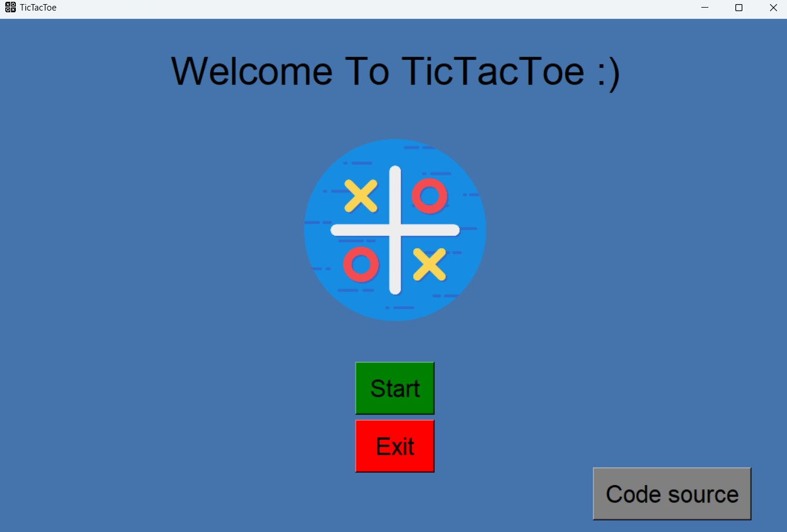

# TicTacToe-Python

## Description
Ce projet est un jeu de TicTacToe (ou Morpion) simple développé en Python avec la bibliothèque `tkinter` pour l'interface graphique. Le jeu permet à deux joueurs de jouer en alternant les symboles "X" et "O" sur une grille 3x3. Le joueur qui réussit à aligner trois symboles horizontalement, verticalement ou en diagonale remporte la partie.

## Fonctionnalités
- Interface graphique intuitive avec `tkinter`.
- Alternance automatique entre les joueurs "X" et "O".
- Détection des victoires (horizontale, verticale, diagonale).
- Gestion des égalités (Match nul).
- Boutons pour démarrer une nouvelle partie et quitter le jeu.
- Menu intégré avec options pour commencer une nouvelle partie et quitter.
- Lien vers le code source sur GitHub.

## Structure du Projet
Le projet est composé de deux fichiers principaux :

1. **`home.py`** :
   - Contient l'interface d'accueil du jeu avec un titre, une image et des boutons pour :
     - Commencer une nouvelle partie.
     - Quitter l'application.
     - Ouvrir le code source sur GitHub.
   - Utilisation de la fonction `main()` de `game.py` pour lancer la partie.

2. **`game.py`** :
   - Contient la logique du jeu TicTacToe.
   - Gère l'affichage de la grille de jeu, la détection des victoires et l'alternance des joueurs.
   - Affiche un message lorsque l'un des joueurs gagne ou si la partie est terminée par une égalité.
   - Possibilité de relancer une nouvelle partie via le menu ou après la fin du jeu.

## Installation

1. **Cloner le dépôt GitHub :**
   ```bash
   git clone https://github.com/ayoubtrabelsitr/TicTacToe-Python.git
2. **Accéder au répertoire du projet :**
   ```bash
   cd TicTacToe-Python
3. **Installer les dépendances :**
   Assurez-vous d'avoir Python installé (version 3 ou supérieure).
   Aucune bibliothèque externe n'est requise, car tkinter est inclus avec Python par défaut.

## Utilisation
- Lancer le jeu : Exécutez le fichier home.py pour démarrer l'interface d'accueil du jeu :
- Commencer une partie : Cliquez sur le bouton "Start" pour démarrer le jeu TicTacToe.
- Quitter le jeu : Vous pouvez quitter à tout moment via le bouton "Exit" ou en fermant la fenêtre.
- Voir le code source : Cliquez sur le bouton "Code source" pour accéder à la page GitHub du projet.

## Captures
**Page d'accueil**



